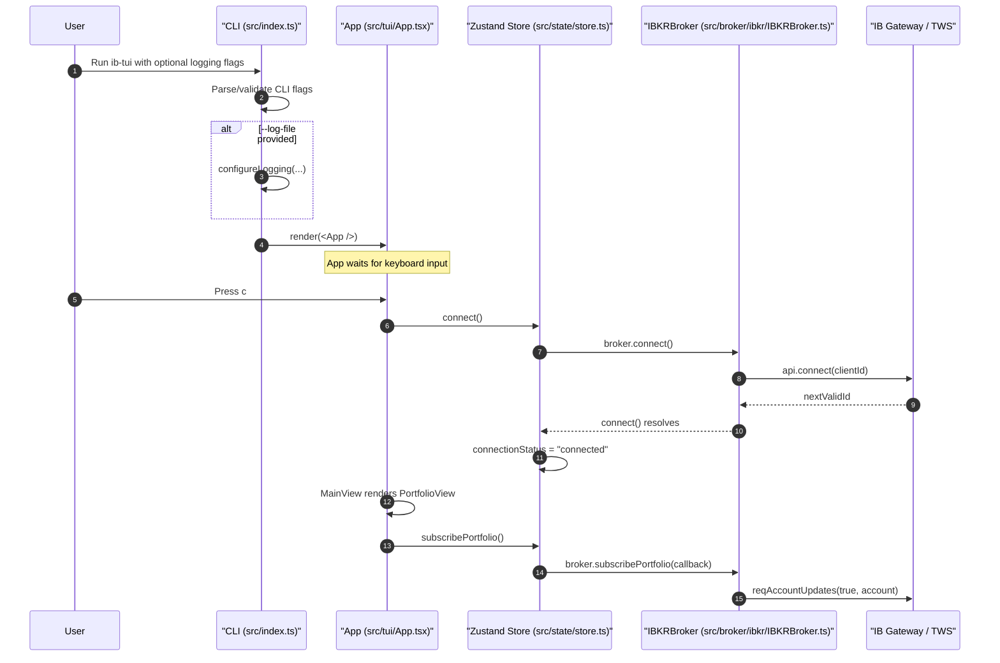
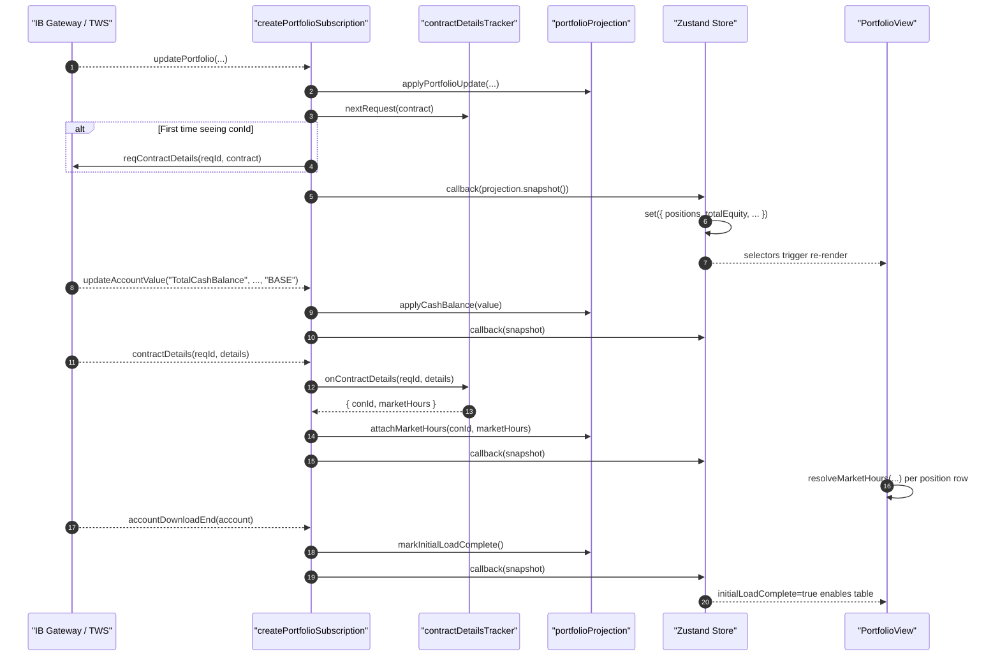

# Main Flow Walkthrough

This document traces the runtime flow end-to-end with executable references (`file:line`) so you can follow the app path directly in code.

## 1) Startup + Connect Sequence

## 2) Event Propagation Sequence (IBKR -> Store -> UI)

## 3) Step-by-Step File:Line Trace

### Startup to First Subscription

1. [src/index.ts:10](../src/index.ts) reads CLI args (`process.argv.slice(2)`).
2. [src/index.ts:25](../src/index.ts) and [src/index.ts:26](../src/index.ts) parse `--log-file` / `--log-level`.
3. [src/index.ts:41](../src/index.ts) configures file logging when requested.
4. [src/index.ts:63](../src/index.ts) renders Ink with `<App />`.
5. [src/state/store.ts:26](../src/state/store.ts) creates a single broker instance (`new IBKRBroker()`).
6. [src/tui/App.tsx:13](../src/tui/App.tsx) registers keyboard handlers (`c` connect, `q` quit).
7. [src/tui/App.tsx:17](../src/tui/App.tsx) calls `connect()` when `c` is pressed from disconnected/error states.
8. [src/state/store.ts:38](../src/state/store.ts) moves status to `"connecting"`.
9. [src/broker/ibkr/IBKRBroker.ts:62](../src/broker/ibkr/IBKRBroker.ts) creates `IBApi`; [src/broker/ibkr/IBKRBroker.ts:67](../src/broker/ibkr/IBKRBroker.ts) wires event handlers.
10. [src/broker/ibkr/IBKRBroker.ts:74](../src/broker/ibkr/IBKRBroker.ts) waits for `nextValidId` to resolve connection.
11. [src/state/store.ts:57](../src/state/store.ts) sets status to `"connected"`.
12. [src/tui/App.tsx:54](../src/tui/App.tsx) now renders `PortfolioView`.
13. [src/tui/PortfolioView.tsx:172](../src/tui/PortfolioView.tsx) mount effect calls `subscribePortfolio()`.
14. [src/state/store.ts:83](../src/state/store.ts) delegates to `broker.subscribePortfolio(...)`.
15. [src/broker/ibkr/IBKRBroker.ts:137](../src/broker/ibkr/IBKRBroker.ts) builds portfolio subscription through `createPortfolioSubscription(...)`.
16. [src/broker/ibkr/portfolio/createPortfolioSubscription.ts:109](../src/broker/ibkr/portfolio/createPortfolioSubscription.ts) to [src/broker/ibkr/portfolio/createPortfolioSubscription.ts:113](../src/broker/ibkr/portfolio/createPortfolioSubscription.ts) register IB event listeners.
17. [src/broker/ibkr/portfolio/createPortfolioSubscription.ts:116](../src/broker/ibkr/portfolio/createPortfolioSubscription.ts) starts `reqAccountUpdates(true, accountId)`.

### Broker Identity and Account Selection

1. [src/broker/ibkr/IBKRBroker.ts:51](../src/broker/ibkr/IBKRBroker.ts) handles `managedAccounts`.
2. [src/broker/ibkr/IBKRBroker.ts:54](../src/broker/ibkr/IBKRBroker.ts) stores the selected primary `accountId`.
3. [src/broker/ibkr/portfolio/createPortfolioSubscription.ts:24](../src/broker/ibkr/portfolio/createPortfolioSubscription.ts) reads account ID lazily (string or function).
4. [src/broker/ibkr/portfolio/createPortfolioSubscription.ts:27](../src/broker/ibkr/portfolio/createPortfolioSubscription.ts) to [src/broker/ibkr/portfolio/createPortfolioSubscription.ts:30](../src/broker/ibkr/portfolio/createPortfolioSubscription.ts) filters events by account, but accepts all when account ID is still empty.

### `updatePortfolio` Event Path

1. [src/broker/ibkr/portfolio/createPortfolioSubscription.ts:32](../src/broker/ibkr/portfolio/createPortfolioSubscription.ts) receives `updatePortfolio`.
2. [src/broker/ibkr/portfolio/createPortfolioSubscription.ts:55](../src/broker/ibkr/portfolio/createPortfolioSubscription.ts) applies event data into projection state.
3. [src/broker/ibkr/portfolio/portfolioProjection.ts:25](../src/broker/ibkr/portfolio/portfolioProjection.ts) to [src/broker/ibkr/portfolio/portfolioProjection.ts:48](../src/broker/ibkr/portfolio/portfolioProjection.ts) upserts/removes position and recomputes market value.
4. [src/broker/ibkr/portfolio/createPortfolioSubscription.ts:57](../src/broker/ibkr/portfolio/createPortfolioSubscription.ts) reuses cached market-hours if present.
5. [src/broker/ibkr/portfolio/createPortfolioSubscription.ts:60](../src/broker/ibkr/portfolio/createPortfolioSubscription.ts) asks tracker if contract details must be fetched.
6. [src/broker/ibkr/portfolio/contractDetailsTracker.ts:26](../src/broker/ibkr/portfolio/contractDetailsTracker.ts) to [src/broker/ibkr/portfolio/contractDetailsTracker.ts:43](../src/broker/ibkr/portfolio/contractDetailsTracker.ts) deduplicates and allocates `reqId`.
7. [src/broker/ibkr/portfolio/createPortfolioSubscription.ts:63](../src/broker/ibkr/portfolio/createPortfolioSubscription.ts) issues `reqContractDetails` when needed.
8. [src/broker/ibkr/portfolio/createPortfolioSubscription.ts:65](../src/broker/ibkr/portfolio/createPortfolioSubscription.ts) emits current snapshot to the store callback.
9. [src/state/store.ts:92](../src/state/store.ts) to [src/state/store.ts:99](../src/state/store.ts) writes snapshot fields into Zustand state.
10. [src/tui/PortfolioView.tsx:158](../src/tui/PortfolioView.tsx) to [src/tui/PortfolioView.tsx:163](../src/tui/PortfolioView.tsx) selectors read updated state and re-render.

### `updateAccountValue` Cash Path

1. [src/broker/ibkr/portfolio/createPortfolioSubscription.ts:68](../src/broker/ibkr/portfolio/createPortfolioSubscription.ts) receives `updateAccountValue`.
2. [src/broker/ibkr/portfolio/createPortfolioSubscription.ts:74](../src/broker/ibkr/portfolio/createPortfolioSubscription.ts) keeps only `TotalCashBalance` in `BASE`.
3. [src/broker/ibkr/portfolio/createPortfolioSubscription.ts:78](../src/broker/ibkr/portfolio/createPortfolioSubscription.ts) updates cash in projection.
4. [src/broker/ibkr/portfolio/portfolioProjection.ts:50](../src/broker/ibkr/portfolio/portfolioProjection.ts) to [src/broker/ibkr/portfolio/portfolioProjection.ts:53](../src/broker/ibkr/portfolio/portfolioProjection.ts) parses and stores cash.
5. [src/broker/ibkr/portfolio/createPortfolioSubscription.ts:79](../src/broker/ibkr/portfolio/createPortfolioSubscription.ts) emits a new snapshot.

### `contractDetails` Market-Hours Enrichment Path

1. [src/broker/ibkr/portfolio/createPortfolioSubscription.ts:92](../src/broker/ibkr/portfolio/createPortfolioSubscription.ts) receives `contractDetails`.
2. [src/broker/ibkr/portfolio/createPortfolioSubscription.ts:101](../src/broker/ibkr/portfolio/createPortfolioSubscription.ts) correlates via tracker.
3. [src/broker/ibkr/portfolio/contractDetailsTracker.ts:45](../src/broker/ibkr/portfolio/contractDetailsTracker.ts) to [src/broker/ibkr/portfolio/contractDetailsTracker.ts:55](../src/broker/ibkr/portfolio/contractDetailsTracker.ts) builds and caches `PositionMarketHours`.
4. [src/broker/ibkr/portfolio/createPortfolioSubscription.ts:103](../src/broker/ibkr/portfolio/createPortfolioSubscription.ts) attaches market hours to existing position.
5. [src/broker/ibkr/portfolio/portfolioProjection.ts:60](../src/broker/ibkr/portfolio/portfolioProjection.ts) to [src/broker/ibkr/portfolio/portfolioProjection.ts:65](../src/broker/ibkr/portfolio/portfolioProjection.ts) merges market-hours into position state.
6. [src/tui/PortfolioView.tsx:73](../src/tui/PortfolioView.tsx) computes open/closed status via `resolveMarketHours(...)`.
7. [src/broker/ibkr/market-hours/resolveMarketHours.ts:131](../src/broker/ibkr/market-hours/resolveMarketHours.ts) to [src/broker/ibkr/market-hours/resolveMarketHours.ts:176](../src/broker/ibkr/market-hours/resolveMarketHours.ts) parses schedule and computes transition countdown.

### Initial Snapshot Completion Path

1. [src/broker/ibkr/portfolio/createPortfolioSubscription.ts:82](../src/broker/ibkr/portfolio/createPortfolioSubscription.ts) handles `accountDownloadEnd`.
2. [src/broker/ibkr/portfolio/createPortfolioSubscription.ts:88](../src/broker/ibkr/portfolio/createPortfolioSubscription.ts) marks initial load complete.
3. [src/broker/ibkr/portfolio/portfolioProjection.ts:55](../src/broker/ibkr/portfolio/portfolioProjection.ts) to [src/broker/ibkr/portfolio/portfolioProjection.ts:58](../src/broker/ibkr/portfolio/portfolioProjection.ts) flips `initialLoadComplete`.
4. [src/tui/PortfolioView.tsx:177](../src/tui/PortfolioView.tsx) switches UI from loading message to table once this is true.

### Disconnect and Cleanup Path

1. [src/tui/App.tsx:14](../src/tui/App.tsx) to [src/tui/App.tsx:16](../src/tui/App.tsx) handles `q` / `Ctrl+C`, calls `disconnect()`, then exits Ink app.
2. [src/state/store.ts:64](../src/state/store.ts) to [src/state/store.ts:76](../src/state/store.ts) disconnects broker and clears portfolio state.
3. [src/broker/ibkr/IBKRBroker.ts:83](../src/broker/ibkr/IBKRBroker.ts) to [src/broker/ibkr/IBKRBroker.ts:89](../src/broker/ibkr/IBKRBroker.ts) calls underlying IB API disconnect.
4. [src/tui/PortfolioView.tsx:173](../src/tui/PortfolioView.tsx) to [src/tui/PortfolioView.tsx:175](../src/tui/PortfolioView.tsx) cleanup unsubscribes on unmount.
5. [src/broker/ibkr/portfolio/createPortfolioSubscription.ts:118](../src/broker/ibkr/portfolio/createPortfolioSubscription.ts) to [src/broker/ibkr/portfolio/createPortfolioSubscription.ts:127](../src/broker/ibkr/portfolio/createPortfolioSubscription.ts) removes listeners and stops `reqAccountUpdates`.
6. [src/broker/ibkr/IBKRBroker.ts:35](../src/broker/ibkr/IBKRBroker.ts) to [src/broker/ibkr/IBKRBroker.ts:39](../src/broker/ibkr/IBKRBroker.ts) handles unexpected broker disconnect and fans out callbacks.
7. [src/state/store.ts:44](../src/state/store.ts) to [src/state/store.ts:55](../src/state/store.ts) receives that callback and resets state to `"disconnected"` with `"Connection lost"`.
